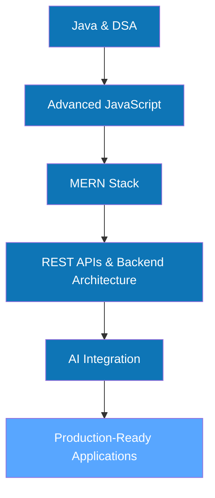

<!-- ======================= HEADER ======================= -->
<div align="center">


<a href="https://github.com/tejasvirajput">
  
</a>
<a href="https://github.com/tejasvirajput?tab=followers">
  
</a>
<a href="https://github.com/tejasvirajput">
  
</a>
<a href="https://github.com/tejasvirajput">
  
</a>

</div>

<br/>

<!-- ======================= ABOUT ======================= -->

## 👨‍💻 About Me

I'm a passionate **Full-Stack Developer from India** who enjoys building modern, scalable and user-focused web applications.

```yaml
name: Tejasvi Rajput
role: Full-Stack Developer (MERN)
currently_building: Wanderlust
currently_learning: [Advanced JavaScript, MERN Stack, AI Integration, DSA]
tech_stack: [React, Node.js, Express, MongoDB]
exploring: AI-powered applications & integrations
open_to_collaborate: [NovaChat, Simon-Says]
ask_me_about: [Java, JavaScript, MERN, REST APIs, MongoDB, AI, DSA]
contact: tejasvirajput123@gmail.com
fun_fact: "I debug with patience and celebrate with chai ☕"
```

---

<!-- ======================= CONNECT ======================= -->

## 🌐 Connect With Me

<p align="left">
  <a href="https://linkedin.com/in/tejasvirajput" target="_blank">
    
  </a>
  &nbsp;
  <a href="https://leetcode.com/tejasvi_rajput" target="_blank">
    
  </a>
  &nbsp;
  <a href="mailto:tejasvirajput123@gmail.com">
    
  </a>
</p>

---

<!-- ======================= TECH STACK ======================= -->

## 🛠️ Tech Stack

<table>
<tr>
<td valign="top" width="25%">

**Languages**
<p></p>

</td>
<td valign="top" width="25%">

**Frontend**
<p></p>

</td>
<td valign="top" width="25%">

**Backend & DB**
<p></p>

</td>
<td valign="top" width="25%">

**Tools**
<p></p>

</td>
</tr>
</table>

---

<!-- ======================= FEATURED PROJECTS ======================= -->

## 🚀 Featured Projects

<table>
<tr>

<td width="50%">

### 💬 NovaChat
**Real-time chat & video calling application**

⚡ Real-time messaging &nbsp;•&nbsp; 📹 Video calling &nbsp;•&nbsp; 🔐 Auth &nbsp;•&nbsp; 🤖 AI integration

<a href="https://github.com/tejasvirajput/NovaChat-video-calls-app">
  
</a>

</td>

<td width="50%">

### 🌍 Wanderlust
**Full-stack travel & accommodation platform**

🏨 Listings &nbsp;•&nbsp; 🔐 Auth &nbsp;•&nbsp; 📍 Location-based &nbsp;•&nbsp; 📝 Reviews

<a href="https://github.com/tejasvirajput/Wanderlust">
  
</a>

</td>

</tr>
<tr>

<td width="50%">

### 🎮 Simon Says
**Interactive memory game**

🎯 Game logic &nbsp;•&nbsp; 🧠 Memory gameplay &nbsp;•&nbsp; 🎨 Responsive UI

<a href="https://github.com/tejasvirajput/Simon-Says">
  
</a>

</td>

<td width="50%" valign="middle" align="center">

### 💡 More Projects

Explore my GitHub for more experiments, learning projects, DSA solutions and full-stack apps.

<a href="https://github.com/tejasvirajput?tab=repositories">
  
</a>

</td>

</tr>
</table>

---

<!-- ======================= GITHUB ANALYTICS ======================= -->

## 📊 GitHub Analytics

<p align="center">
  
  
</p>

<p align="center">
  
</p>

---

<!-- ======================= ACTIVITY GRAPH ======================= -->

## 📈 Contribution Activity

<p align="center">
  
</p>

---

<!-- ======================= GITHUB TROPHIES ======================= -->

## 🏆 GitHub Trophies

<p align="center">
  
</p>

---

<!-- ======================= LEARNING ROADMAP ======================= -->

## 🧠 Currently Learning

<div align="center">



</div>

---

<div align="center">

### 💭 "I debug with patience and celebrate with chai ☕"


</div>
